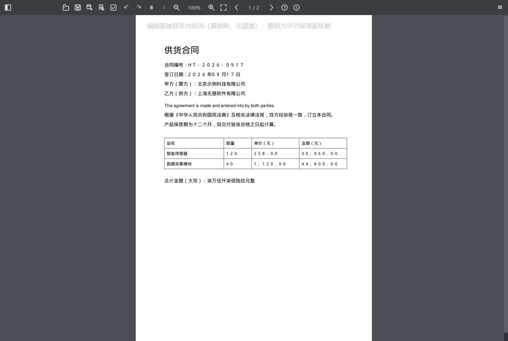

# PDF 无感编辑器

桌面端 PDF 编辑器：以文本框为单元做类 PPT 编辑。提交时改的是 PDF **内容流**（真删除 + 原位重建），不是在页面上盖一层字。撤销通过页面字节快照回到原版。

**作者：** [Sala](https://github.com/Sylas-Lake)、[sh1man2357](https://github.com/sh1man2357)  
**版本：** [v0.2.0](https://github.com/Sylas-Lake/pdf_seamless_editor/releases/tag/v0.2.0) · [AGPL-3.0](LICENSE)



## 下载

Windows 10/11（64 位），到 [Releases](https://github.com/Sylas-Lake/pdf_seamless_editor/releases/tag/v0.2.0) 取最新包：

| 文件 | 说明 |
|------|------|
| [PDFSeamlessEditor-0.2.0-windows-x64-setup.exe](https://github.com/Sylas-Lake/pdf_seamless_editor/releases/download/v0.2.0/PDFSeamlessEditor-0.2.0-windows-x64-setup.exe) | 安装程序（约 53 MB）。开始菜单快捷方式，可选桌面图标 |
| [PDFSeamlessEditor-0.2.0-windows-x64.zip](https://github.com/Sylas-Lake/pdf_seamless_editor/releases/download/v0.2.0/PDFSeamlessEditor-0.2.0-windows-x64.zip) | 便携版。解压后运行 `PDFSeamlessEditor.exe` |

安装向导会出示 AGPL 许可证。本程序**不会**改成系统默认 PDF 打开方式；可在资源管理器「打开方式」里选用。

macOS / Linux 请 [从源码运行](#从源码运行)。

## 怎么用

启动后是空工作台：点页面打开 PDF，或把文件拖进去。

- **单击**文本框：选中；拖动移动；左右手柄调宽
- **双击**文本框：进入框内编辑（光标、选区、输入法）
- **方向键**：选中框后轴向平移（Shift 加速）
- **粗体 / 斜体**：工具栏按钮，或 `Ctrl+B` / `Ctrl+I`
- **图片**：移动、手柄缩放（所见即所得）
- **撤销 / 重做**：`Ctrl+Z` / `Ctrl+Y`，恢复该页原始字节，不是再插一遍字
- 缩放：`Ctrl` + 滚轮；横向平移：`Shift` + 滚轮；页边滚轮翻页
- 打开 / 保存：`Ctrl+O` / `Ctrl+S`；另存为：`Ctrl+Shift+S`

失焦、换页、保存前会自动提交当前编辑框。

保真指示：绿（原生）/ 黄（局部重建，例如换了字体）/ 橙（超出原区域）/ 红（扫描件，无法改字）。

## 已知限制

- 部分 PDF 的斜体在编辑后可能掉成正体，可用斜体按钮手动加回
- 扫描页（纯图片）不能当文字改
- 目前只有 Windows 安装包；其它系统从源码运行

问题请开 [Issues](https://github.com/Sylas-Lake/pdf_seamless_editor/issues)。

## 从源码运行

需要 **Python 3.10+**，Windows / macOS / Linux 均可（界面依赖 Qt）。

```bash
git clone https://github.com/Sylas-Lake/pdf_seamless_editor.git
cd pdf_seamless_editor

python -m venv .venv
# Windows
.venv\Scripts\activate
# macOS / Linux
source .venv/bin/activate

pip install -r requirements.txt
python main.py
```

指定文件启动：

```bash
python main.py 你的文件.pdf
```

## 许可证

Copyright © 2026 [Sala](https://github.com/Sylas-Lake)、[sh1man2357](https://github.com/sh1man2357)

本软件以 [GNU Affero General Public License v3.0](LICENSE) 发布，**不含任何担保**。你可以免费使用、修改、再分发；若再分发（含把改过的版本做成在线服务），需要按 AGPL 公开对应源码。

PDF 引擎使用 [PyMuPDF](https://pymupdf.readthedocs.io/)（Artifex），同样为 AGPL-3.0。界面使用 PySide6（LGPL）。若需要闭源商用，请自行向 Artifex 了解 PyMuPDF 的商业授权，本仓库不提供商业授权。

## 开发

```bash
pip install -e ".[dev]"
pytest -m "not gui"     # 核心（无头，CI 默认）
pytest -m gui           # GUI 冒烟（需显示或 QT_QPA_PLATFORM=offscreen）
ruff check core ui tests main.py
```

兼容入口：`python selftest.py`、`python smoke_gui.py`。生成演示 PDF（不经 GUI）：

```bash
python -c "from core.sample import create_sample_pdf; create_sample_pdf('demo.pdf')"
```

打 Windows 安装包（第一次会建 `.packaging-venv`；本机需安装 [Inno Setup 6](https://jrsoftware.org/isinfo.php) 才会生成 setup.exe）：

```bash
powershell -File packaging/build.ps1
```

产物在 `dist/`。

| 路径 | 职责 |
|------|------|
| `main.py` | 入口 |
| `core/` | PDF 引擎（无 Qt） |
| `ui/` | PySide6 界面 |
| `packaging/` | Windows 安装包（PyInstaller + Inno Setup） |
| `tests/` | pytest |

合入约定见 [AGENTS.md](AGENTS.md)。
